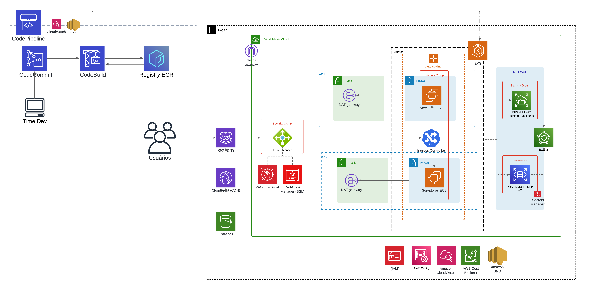
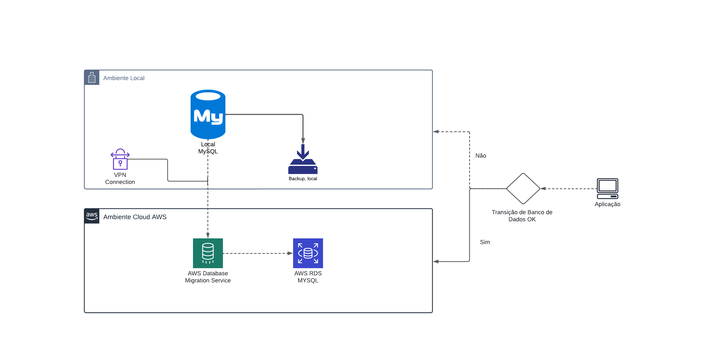

## Projeto Final Programa de Estágios DevSecOps - CompassUOL

Equipe:

### Objetivos 
- Desenvolver a arquitetura para um eCommerce usando as melhores práticas de Devops
  - Ambiente Kubernetes
  - Banco de dados PaaS MySQL
  - Balanceamento de carga 
  - Segurança

### Diagrama técnico - Infraestrutura AWS

### Diagrama da Migração do Banco de Dados On-Premisse para AWS RDS

## Recursos usados no projeto:

### Pipeline CI/CD

- 
 AWS CodePipeline
  Para gerenciar a pipeline de deploy
- 
 AWS CodeCommit
  Como repositório e versionamento de código, nessa arquitetura é onde recebemos o entregável da equipe dev
- 
AWS CodeBuild
  Para Converter o código em imagem docker, e depois realizar o deploy no cluster EKS via kubectl
- 
 AWS ECR
  Como registry privado para as imagens Docker.

### Migração do Banco de Dados On-Premisse para AWS RDS

- 
VPN Connection
  Prover segurança na conexão MySQL local para o AWS DMS
- 
DMS
  Serviço de migração de banco de dados da AWS, para replicar em tempo real o MySQL On-Premisse para RDS MySQL na nuvem AWS, objetivando menor janela de manutenção.
- 
AWS RDS MySQL
 Serviço de banco de dados SQL na nuvem AWS, usamos como multi-az para failover (Quando um banco cai outro assume em segundos).
- Após migração completa a applicação para a responder na nuvem AWS

### Arquitetura da Aplicação 

> Optamos por um cluster de EKS em multi-az, com subnets totalmente privadas, dessa forma provendo alta disponíbilidade e segurança a aplicação. A aplicação recebe tráfego a partir de um load balancer de camada 7 aberto para internet, os servidores são gerenciados usando kubernetes,  acessam internet via NAT gateway.

- 
Route 53
  Hospeda nossas zonas de DNS
- 
Cloudfront
  Fornece CDN ( Cache de borda para acelerar a entrega de conteúdo ao usuário da aplicação)
- 
AWS S3
  Para armazenar os estáticos da aplicação
- 
Load Balancer de aplicação
  Para fazer o balanceamento de carga e verificar a integridade dos servidores
- 
WAF - Web Application Firewall
  Firewall de aplicação para proteger o Load Balancer de ataques, como SQL injection, DDoS entre outros...
- 
ACM
  Para fornecer certificado SSL, provendo conexão segura do usuário para a aplicação.
- NAT Gateway
  Para permitir que os servidores saiam para a internet mas não sejam accessíveis da internet
- 
EC2
  Servidores Linux
- 
Auto Scaling
  Para fornecer elasticidade a infraestrutura, permitindo que ela se adapte rápidamente a demanda da aplicação, adicionando ou removendo servidores conforme demanda, Escalabilidade Horizontal.
- 
EKS
  Serviço de Kubernetes gerenciado da AWS, fornecendo node Master totalmente gerenciado.
- 
EFS
  Sistema de NFS para fornecer persistência de volume para nossos pods de kubernetes.

### Serviços de Segurança e gestão 

- 
IAM 
Configurar e gerenciar regras de acesso para o Ambiente AWS, tanto de Usuários quanto de um recurso para o outro.
- 
CloudWatch
  Fornecer observabilidade do cluster, e também do ambiente AWS e seus recursos, coletando logs, métricas e gerando alertas em cima dessas métricas.
- 
SNS
  Serviço de notificação, a partir dos alertas do cloudwatch envia notificação para o responsável. Pode trabalhar junto com o cloudwatch e com cost Explorer
- 
AWS Config
 Permite acompanhar as alterações realizadas nos recursos aws, permitindo controles de conformidade e rastreabilidade
- 
Secrets Manager
  Responsável por gerenciar as credenciais do RDS, permitindo rotacionar essas credencias conforme configuração, e não sendo necessário codificar na aplicação.
- 
Cost Explorer
  Usado para acompanhar o financeiro da infra AWS, permitindo acompanhar e otimizar a arquitetura sob a ótica de custos. 

> Além disso foi proposto um plano de suporte visando acompanhar a aplicação e ajustar seus recursos de acordo com o crescimento de demanda da aplicação e análise do seu comportamento, visando propor estratégias de otimização de custos e infra, seguindo o well-architected framework

